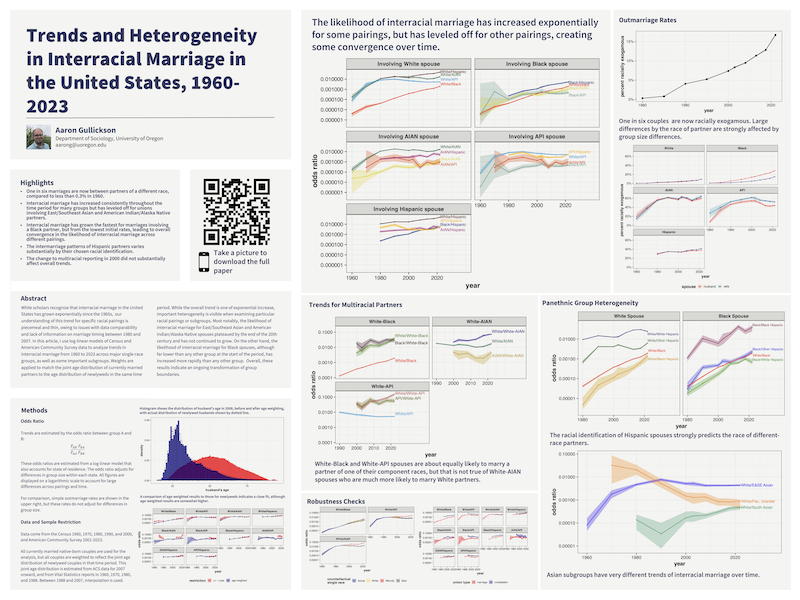

```{r}
#| label: setup
#| include: false
library(here)
source(here("utils","check_packages.R"))
source(here("utils","functions.R"))
```

```{r}
#| label: load-data

load(here("data", "data_constructed", "model_state_bs.RData"))
load(here("data", "data_constructed", "age_weight_example.RData"))
```

```{r}
#| label: set-theme

theme_slides <- function(base_size = 24) {
  theme_bw(base_size = base_size)+
    theme(
      #plot.title = element_text(size=24, hjust=0),
      plot.title.position = "panel",
      #plot.subtitle = element_text(size=16, hjust=0),
      #plot.caption = element_text(size=14, hjust=1, vjust=1),
      plot.caption.position = "panel",
      text = element_text(colour="#131516"),
      #axis.title = element_text(size=20),
      #axis.line = element_line(colour="#131516", size = 1),
      #axis.ticks = element_line(colour="#131516", size = 1),
      #axis.text = element_text(size=18),
      #legend.title = element_text(size=20),
      #legend.text = element_text(size=18),
      #strip.text = element_text(size = 18),
      #strip.background = element_rect(size = 2, fill = "grey", color = "black"),
      #panel.grid.major.x= element_blank(),
      panel.grid.minor = element_blank(), 
      #panel.border = element_rect(linewidth = 2),
      panel.background = element_rect(fill = "#F4F4F2",colour = NA),
      plot.background = element_rect(fill = "#F4F4F2",colour = NA),
      legend.background = element_rect(fill = "#F4F4F2",colour = NA),
      legend.key = element_rect(fill = "#F4F4F2",colour = NA), 
      legend.position = "bottom"
    )
}
```

```{r}
#| label: load-color-palettes

palette <- c(
  # Single race combinations
  "White/Black"                   = "#FF3B00",  # rich orange
  "White/AIAN"                    = "#00785E",  # teal green
  "White/API"                     = "#00A6D6",  # muted magenta
  "White/Hispanic"                = "#661100",  # deep rust
  "Black/AIAN"                    = "#E6D945",  # warm brown
  "Black/API"                     = "#74AA99",  # muted cyan
  "Black/Hispanic"                = "#0B3D91",  # deep burgundy
  "AIAN/API"                      = "#F05A1A",  # desaturated turquoise
  "AIAN/Hispanic"                 = "#C0408C",  # dusty rose
  "API/Hispanic"                  = "#FFC107",  # yellow-gold
  
  # Single race to multiracial combinations
  "White/White-Black"             = "#3E8F0D",  # vivid spring green
  "Black/White-Black"             = "#471624",  # deep maroon-brown
  "White/White-AIAN"              = "#361892",  # royal indigo
  "AIAN/White-AIAN"               = "#C9A227",  # bright teal-blue
  "White/White-API"               = "#CC6666",  # slate blue
  "API/White-API"                 = "#6D7003",  # olive drab
  "Black/Black-API"               = "#1117AA",  # bold cobalt blue
  "API/Black-API"                 = "#6D4113",  # dark umber
  "Black/Black-AIAN"              = "#7171BB",  # muted periwinkle
  "AIAN/Black-AIAN"               = "#422D13",  # earthy espresso
  
  # Hispanic subgroups with White and Black
  "White/White Hispanic"           = "#552288",  # soft purple
  "White/Black Hispanic"           = "#E1A400",  # rose plum
  "White/Other Hispanic"           = "#287B33",  # leafy green
  "Black/White Hispanic"           = "#33A02C",  # olive yellow
  "Black/Black Hispanic"           = "#9C2C5C",  # reddish brick
  "Black/Other Hispanic"           = "#2C37DA",  # vivid sapphire
  
  # Asian subgroups with White
  "White/EastAsian"               = "#3366AA",  # steely blue
  "White/E&SE Asian"              = "#3311EE",  # steel sky blue
  "White/SEAsian"                 = "#118877",  # sea green
  "White/South Asian"             = "#009E73",  # muted violet-magenta
  
  # Indigenous subgroups with White
  "White/AIAN"                    = "#CC4477",  # muted raspberry rose
  "White/Pac. Islander"           = "#FF8C00",  # orange red
  
  # Intra-Hispanic
  "WhiteHispanic/BlackHispanic"   = "#BB8866",  # muted tan
  "WhiteHispanic/OtherHispanic"   = "#885577",  # dusty mauve
  "BlackHispanic/OtherHispanic"   = "#AA8844",  # muted amber
  
  # Intra-Asian
  "EastAsian/SEAsian"             = "#336633",  # forest moss
  "EastAsian/SouthAsian"          = "#993399",  # grape violet
  "SEAsian/SouthAsian"            = "#CC6666",  # muted rose
  
  # Intra-Indigenous
  "AIAN/PI"                       = "#447777"   # muted teal gray
)

```

## Research Question {.smaller}

 > How has the likelihood of interracial marriage in the United States changed from 1960 to the present across a wide variety of racial groups?

::: {.fragment}

### Why is This Question Important?

* The frequency of interracial marriage and partnership is:
  * A barometer of the strength of current racial boundaries
  * A predictor of potential future racial re-alignment
  
:::

::: {.fragment}

### Don't We Already Know The Answer?

* Our knowledge of long-term trends is largely piecemeal.
  * Lack of data on new marriages between 1990 and 2007 means that most researchers have done a two points in time comparison.
  * Most research has focused on a limited set of groups and often ignores dual-minority pairings.

:::

## Data and Methods {.smaller}

:::: {.columns}

::: {.column width = "50%"}

Trends are calculated from odds ratios:

$$\frac{F_{AB}F_{BA}}{F_{AA}F_{BB}}$$

* Odds ratios are estimated from log-linear models that also adjust for racial composition at the state level.
* Census (1960-2000) and American Community Survey (2001-2023) data is restricted to all extant **native-born** married couples in a given year.
* Weights are applied to each couple to match the joint age distribution of newlyweds in that year.


:::

::: {.column .fragment width = "50%"}

```{r}
#| label: age-dist-fig
#| fig-width: 6.25
#| fig-height: 8

age_weight2008 |>
  ggplot(aes(x = age_husband, y = after_stat(density)))+
  geom_histogram(alpha = 0.7, fill = "red", binwidth = 1)+
  geom_histogram(alpha = 0.7, fill = "navy", binwidth = 1, 
                 aes(weight = weight_age))+
  geom_histogram(data = filter(age_weight2008, dur_mar <= 1),
                 fill = NA, color = "black",  binwidth = 1, linetype = 2)+
  labs(x = "husband's age",
       title = "Age distribution of husbands, ACS 2008",
       subtitle = "red - unweighted, blue - weighted, dotted - newlyweds")+
  theme_slides(18)+
  theme(plot.subtitle = element_text(size = 16))
```
:::

::::

## Overall Trends Involving White Partners

```{r}
#| label: overall-trends-fig

temp <- model_state_bs |>
  filter(!str_detect(term, "-"), str_detect(term, "White/")) 

lims <- exp(c(min(temp$conf.low), 
              max(temp$conf.high)))

temp |>
  ggplot(aes(x = year, y = exp(estimate), color = term))+
  #geom_vline(xintercept = 2000, linetype = 2)+
  geom_ribbon(aes(ymin = exp(conf.low), ymax = exp(conf.high), fill = term),
              alpha = 0.3, color = NA)+
  geom_line()+
  geom_point(size = 0.5)+
  geom_text_repel(data = temp |> filter(year == max(year)),
                  aes(label = term),
                  hjust = 0,
                  nudge_x = 0.5,
                  direction = "y", 
                  segment.color = "grey80", 
                  size = 6,
                  force = 1)+
  labs(y = "odds ratio", color = "pairing", fill = "pairing")+
  scale_y_log10(limits = lims, labels = scales::comma)+
  scale_x_continuous(breaks = c(1960, 1980, 2000, 2020), 
                     limits = c(1960, 2033))+
  scale_color_manual(values = palette)+
  scale_fill_manual(values = palette)+
  theme_slides(30)+
  theme(legend.position = "none")
```

## Highlights {.smaller}

- One in six marriages are now between partners of a different race, compared to less than 0.3% in 1960.
- Interracial marriage has increased consistently throughout the time period for many groups but has leveled off for unions involving East/Southeast Asian and American Indian/Alaska Native partners.
- Interracial marriage has grown the fastest for marriages involving a Black partner, but from the lowest initial rates, leading to overall convergence in the likelihood of interracial marriage across different pairings.
- The intermarriage patterns of Hispanic partners vary substantially by their chosen racial identification.
- The change to multiracial reporting in 2000 did not substantially affect overall trends.


## Come See the Poster!

:::: {.columns}

:::

::: {.column width = "40%"}



{width="30%"}

:::

::: {.column width = "60%"}

::: {.nonincremental}
- Trends for dual minority pairings
- Trends by outmarriage rates
- Trends for large mixed-race groups
- Subgroup analyses for the Hispanic and API groups
- Comparison between marriage and cohabitation
:::

::::
